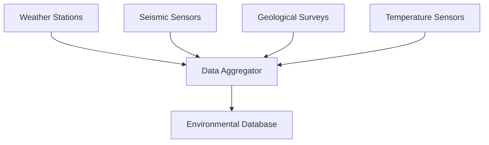

# 🌍 Environmental Data & Monitoring System

## Overview

The Rockfall Detection System now includes comprehensive environmental monitoring capabilities that provide real-time insights into conditions affecting rockfall risk. This document describes the environmental data sources, monitoring systems, and how they integrate with the predictive models.

## 🌡️ Environmental Parameters

### 1. **Rainfall Monitoring**
- **Data Type**: Precipitation measurement in millimeters (mm)
- **Update Frequency**: Real-time with 24-hour accumulation tracking
- **Risk Impact**: High rainfall increases rock saturation and slope instability
- **Threshold Levels**:
  - 🟢 Low Risk: < 10mm/24h
  - 🟡 Moderate Risk: 10-25mm/24h  
  - 🔴 High Risk: > 25mm/24h

### 2. **Temperature Monitoring**
- **Data Type**: Ambient temperature in Celsius (°C)
- **Update Frequency**: Continuous real-time monitoring
- **Risk Impact**: Temperature fluctuations affect freeze-thaw cycles and rock expansion
- **Threshold Levels**:
  - 🟢 Stable: 15-25°C
  - 🟡 Moderate Risk: 0-15°C or 25-35°C
  - 🔴 High Risk: < 0°C or > 35°C

### 3. **Fracture Density Analysis**
- **Data Type**: Number of fractures per square meter (fractures/m²)
- **Data Source**: Geological surveys and image analysis
- **Risk Impact**: Higher fracture density indicates increased rock mass instability
- **Threshold Levels**:
  - 🟢 Low Risk: < 1.0 fractures/m²
  - 🟡 Moderate Risk: 1.0-2.5 fractures/m²
  - 🔴 High Risk: > 2.5 fractures/m²

### 4. **Seismic Activity Monitoring**
- **Data Type**: Earthquake magnitude on Richter scale
- **Update Frequency**: Real-time seismograph monitoring
- **Risk Impact**: Seismic activity can trigger immediate rockfall events
- **Threshold Levels**:
  - 🟢 Minimal: < 1.0 magnitude
  - 🟡 Moderate: 1.0-2.5 magnitude
  - 🔴 High Risk: > 2.5 magnitude

## 📊 Risk Assessment Algorithm

### Overall Risk Calculation
The system calculates an overall risk score using a weighted combination of all environmental factors:

```python
risk_score = (
    (rainfall / 35.0) * 0.3 +           # 30% weight
    (fracture_density / 3.5) * 0.4 +    # 40% weight  
    (seismic_activity / 3.0) * 0.3       # 30% weight
) * 100  # Convert to percentage
```

### Risk Level Classification
- **🟢 LOW RISK**: 0-40% - Normal monitoring
- **🟡 MODERATE RISK**: 40-70% - Increased surveillance  
- **🔴 HIGH RISK**: 70-100% - Immediate attention required

## 🔄 Data Integration Workflow

### 1. **Data Collection**


### 2. **Real-time Processing**
- Environmental data is collected every 10 seconds
- Risk calculations are updated in real-time
- Dashboard displays are refreshed automatically
- Alerts are triggered when thresholds are exceeded

### 3. **Historical Analysis**
- 24-hour trend analysis for all parameters
- Pattern recognition for risk prediction
- Historical correlation with past rockfall events
- Long-term environmental trend monitoring

## 🎯 Dashboard Features

### Environmental Monitoring Cards
Each environmental parameter is displayed in dedicated cards with:
- **Current Value**: Real-time measurement display
- **Trend Indicators**: Visual arrows showing increasing/decreasing trends
- **Color Coding**: Green/Yellow/Red based on risk thresholds
- **Historical Context**: Comparison with normal ranges

### Risk Assessment Display
- **Overall Risk Percentage**: Large, prominent display
- **Risk Level Text**: Clear LOW/MODERATE/HIGH classification
- **Dynamic Colors**: Background changes based on risk level
- **Contributing Factors**: Breakdown of which parameters are driving risk

### Real-time Charts
- **24-Hour Trends**: Line charts showing parameter evolution
- **Risk History**: Historical risk level changes
- **Alert Timeline**: Visual timeline of past alerts and events

## 🚨 Alert System

### Alert Triggers
- Individual parameter thresholds exceeded
- Overall risk score above critical levels
- Rapid changes in environmental conditions
- Sensor malfunction or data loss

### Alert Types
1. **INFO**: Parameter updates and normal operations
2. **WARNING**: Approaching risk thresholds
3. **CRITICAL**: High risk conditions detected
4. **SYSTEM**: Technical alerts and maintenance

### Notification Methods
- Real-time dashboard notifications
- WebSocket push notifications
- Email alerts for critical conditions
- SMS notifications for emergency situations

## 📱 API Integration

### Environmental Data Endpoints
```python
# Get current environmental data
GET /api/environmental/current

# Get historical data for specific parameter
GET /api/environmental/history/{parameter}?hours=24

# Get risk assessment
GET /api/risk/current

# WebSocket for real-time updates
WS /ws/environmental
```

### Data Format
```json
{
  "timestamp": "2025-09-17T10:30:00Z",
  "rainfall": 15.3,
  "temperature": 22.7,
  "fracture_density": 1.8,
  "seismic_activity": 0.5,
  "overall_risk": 42.3,
  "risk_level": "MODERATE"
}
```

## 🔧 Configuration

### Monitoring Parameters
```yaml
environmental_monitoring:
  update_interval: 10  # seconds
  data_retention: 30   # days
  alert_thresholds:
    rainfall_critical: 25    # mm/24h
    temperature_critical: 35 # °C
    fracture_critical: 2.5   # per m²
    seismic_critical: 2.5    # magnitude
```

### Dashboard Settings
```yaml
dashboard:
  refresh_rate: 5      # seconds
  chart_history: 24    # hours
  auto_alerts: true
  color_coding: true
```

## 🛠️ Maintenance & Calibration

### Sensor Maintenance
- Regular calibration of temperature sensors
- Cleaning and alignment of seismic equipment
- Validation of rainfall measurement accuracy
- Periodic geological survey updates

### Data Quality Assurance
- Automated data validation checks
- Anomaly detection for sensor malfunctions
- Cross-validation between multiple sensors
- Manual quality control reviews

### System Monitoring
- Real-time health checks for all sensors
- Network connectivity monitoring
- Database performance optimization
- Regular backup and recovery testing

---

This environmental monitoring system provides the foundation for accurate, real-time rockfall risk assessment and early warning capabilities.