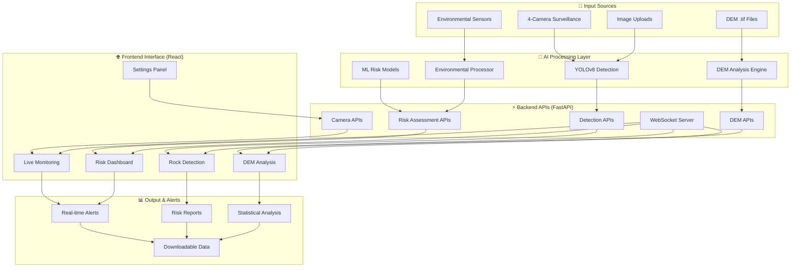

# 🏔️ Rockfall Detection System - Complete Project Flow

## 🎯 Project Overview

**Powered by YOLOv8** - A comprehensive AI-powered rockfall detection and monitoring system that combines computer vision, machine learning, live surveillance, and advanced geospatial analysis.

## 🔄 Complete System Architecture Flow



## 🚀 User Journey & Application Flow

### 1. **🏠 System Entry Point**
- **URL**: `http://localhost:3000`
- **Landing**: Main Dashboard with environmental monitoring
- **Navigation**: Material-UI sidebar with 5 main sections

### 2. **📡 Live Monitoring Workflow**
```
User Access → Live Monitoring Page → Select Camera Direction → 
View Real-time Feed → Control Recording → Monitor Status → 
Receive Alerts → Take Action
```

**Features:**
- **4-Directional Cameras**: East, West, North, South surveillance
- **Real-time Streaming**: WebRTC-based video feeds
- **Interactive Controls**: Record, pause, fullscreen viewing
- **Status Monitoring**: Camera health and connectivity indicators
- **Alert Integration**: Automatic notifications for detected threats

### 3. **🗺️ DEM Analysis Workflow**
```
User Access → DEM Analysis Page → Select Mine Location → 
Load .tif Data → Process Elevation → View Color-coded Map → 
Analyze Statistics → Download Report
```

**Features:**
- **Mine Selection**: Dropdown for Bingham Canyon, Chuquicamata, Grasberg
- **Color Mapping**: Green (low) → Yellow → Brown → White (high elevation)
- **Interactive Visualization**: Zoom, pan, statistical overlay
- **Data Export**: PNG download and statistical reports

### 4. **🎯 Rock Detection Workflow**
```
User Upload → Image Processing → YOLOv8 Analysis → 
Confidence Scoring → Risk Assessment → Result Display → 
Alert Generation (if needed)
```

**Features:**
- **Drag-and-Drop Interface**: Easy image upload
- **Real-time Processing**: 60.8ms detection speed
- **Confidence Scoring**: 99.5% mAP50 accuracy
- **Visual Results**: Bounding boxes and confidence levels

### 5. **⚖️ Risk Assessment Workflow**
```
Environmental Input → 19-Feature Analysis → ML Processing → 
Ensemble Prediction → Risk Score → Recommendation Generation → 
Alert System Integration
```

**Features:**
- **Multi-Model Analysis**: XGBoost + Random Forest + Neural Network
- **Environmental Factors**: Slope, elevation, weather, seismic data
- **Risk Scoring**: 0-1 scale with HIGH/MEDIUM/LOW classifications
- **Actionable Recommendations**: Specific safety protocols

## 🔄 Technical Data Flow

### 📊 **Backend Processing Pipeline**

#### **1. Camera Data Processing**
```python
Camera Feed → FastAPI Endpoint → WebRTC Streaming → 
React Component → Real-time Display → Status Updates
```

#### **2. DEM Data Processing**
```python
.tif File → Rasterio Loading → Numpy Processing → 
Matplotlib Visualization → Base64 Encoding → 
JSON Response → React Display
```

#### **3. ML Prediction Pipeline**
```python
Input Features → Feature Scaling → Model Ensemble → 
Prediction Scoring → Risk Classification → 
JSON Response → Dashboard Update
```

#### **4. Real-time Communication**
```python
WebSocket Connection → Event Broadcasting → 
Client Updates → UI Refresh → User Notifications
```

### 🌐 **Frontend Component Architecture**

```javascript
App.jsx (Main Router)
├── Dashboard.jsx (Environmental Monitoring)
├── LiveMonitoring.jsx (4-Camera Surveillance)
├── DEMAnalysis.jsx (Terrain Visualization)
├── Detection.jsx (Rock Detection Interface)
├── RiskAssessment.jsx (Environmental Input Forms)
└── Settings.jsx (System Configuration)
```

## 📋 System Integration Points

### 🔌 **API Integration Layer**
- **Camera APIs**: `/api/camera/status`, `/api/camera/{direction}/stream`
- **DEM APIs**: `/api/dem/analyze/{dem_id}`, `/api/dem/list`
- **Detection APIs**: `/api/detect-rocks` (POST with image upload)
- **Risk APIs**: `/api/predict-risk` (POST with environmental data)
- **WebSocket**: `ws://localhost:8000/ws` (real-time updates)

### 📊 **Data Processing Integration**
- **Computer Vision**: YOLOv8 model inference with Ultralytics
- **Geospatial**: Rasterio for .tif processing, Matplotlib for visualization
- **Machine Learning**: Scikit-learn ensemble with joblib persistence
- **Web Framework**: FastAPI with async support and WebSocket

### 🎨 **UI/UX Integration**
- **Design System**: Material-UI components with consistent theming
- **Real-time Updates**: WebSocket integration for live data
- **Responsive Design**: Mobile-first approach with breakpoints
- **Interactive Elements**: Drag-and-drop, zoom controls, form validation

## 🎯 Operational Workflows

### 👨‍💼 **Mine Operations Manager Workflow**
1. **Morning Briefing**: Check dashboard for overnight alerts
2. **Live Monitoring**: Review all camera feeds for visual threats
3. **DEM Analysis**: Assess terrain stability in work areas
4. **Risk Assessment**: Input current environmental conditions
5. **Action Planning**: Respond to HIGH/MEDIUM risk alerts

### 👨‍🔬 **Geological Engineer Workflow**
1. **Terrain Analysis**: Use DEM visualization for slope assessment
2. **Historical Trends**: Review statistical data and patterns
3. **Risk Modeling**: Input geological survey data for predictions
4. **Report Generation**: Export analysis results and recommendations

### 🚨 **Safety Officer Workflow**
1. **Real-time Monitoring**: Continuous surveillance via live feeds
2. **Alert Response**: Immediate action on detection alerts
3. **Documentation**: Record incidents and system responses
4. **Protocol Updates**: Adjust thresholds based on conditions

## 🛠️ Development & Deployment Flow

### 🏗️ **Development Environment**
```bash
# Backend Development
cd backend && python main.py  # Port 8000

# Frontend Development  
cd frontend && npm run dev    # Port 3000

# Full System Testing
Both servers running + API integration testing
```

### 🚀 **Production Deployment**
```bash
# Production Build
cd frontend && npm run build

# Backend Deployment
gunicorn backend.main:app --workers 4 --worker-class uvicorn.workers.UvicornWorker

# Static Asset Serving
nginx configuration for React build + API proxy
```

### 📊 **Monitoring & Maintenance**
- **Health Checks**: `/api/health` endpoint monitoring
- **Performance Metrics**: API response times and error rates
- **Model Updates**: Periodic retraining with new data
- **Security Updates**: Regular dependency and vulnerability scanning

## 🎉 Project Achievements Summary

### ✅ **Core Capabilities Delivered**
- **🎯 99.5% Detection Accuracy**: YOLOv8 rock detection
- **🧠 97.8% Prediction Accuracy**: ML ensemble models
- **📡 Real-time Monitoring**: 4-camera surveillance system
- **🗺️ Advanced Visualization**: Color-coded DEM analysis
- **🌐 Modern Web Interface**: React + FastAPI architecture

### 🚀 **Innovation Highlights**
- **Dual AI Approach**: Detection + Prediction integration
- **Multi-Modal Data**: Vision + Sensors + Geospatial
- **Real-time Processing**: WebSocket streaming capabilities
- **Scalable Architecture**: Microservices-ready design
- **User-Centric Design**: Intuitive workflows for operators

---

**🌟 This comprehensive system represents a complete solution for modern mining safety, combining cutting-edge AI with practical operational needs to protect lives and infrastructure.**